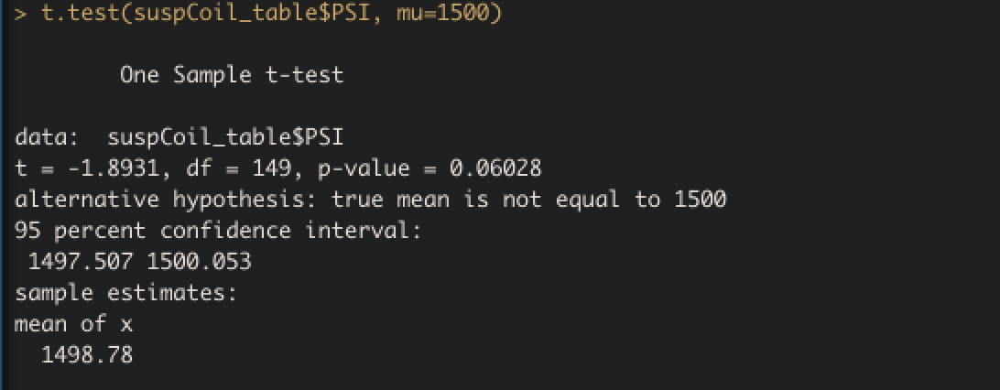

# MechaCar Statistical Analysis

### Overview
This analysis uses the R statistical programming language to generate different statistical analyses: multiple linear regression, 

### Resources
R version 4.0.3 
R Studio version 1.3.1093
VS Code version: 1.51.0

## Linear Regression to Predict MPG

The team analyzed a dataset of MechaCar prototype production data to find the variables best predict the Miles per Gallon (MPG). We ran a multiple linear regression analysis in R and found that of the five independent variables (vehicle length, weight, spoiler angle, ground clearance and whether on not a prototype has AWD), only vehicle length and ground clearance provide a non-random amount of variance to the MPG value, at a 0.05% significance level. 
 
We first generate our multiple linear regression model using R's Fitting Linear Models function: lm()
 

We then generate summary statistical metrics on the regression model using R's summary() function. We see that the p-values of vehicle length(2.60e-12) and ground clearance (5.21e-08) coefficients are well below the 0.05% significance level we utilize for this analysis. Since the Intercept coefficient of our model also has a very low p-value (5.08e-08), it is also statistically significant and indicates that there are other factors, which are not included in this model- that contribute to the variation of MPG. 

 

* The slope of our multiple linear regression model should not be considered to be zero because the p-value of the model (5.35e-11) is much lower than the 0.05% significance level.

* Our analysis produced an R squared of 0.71 that shows that this multiple linear regression model exhibits strong correlation and is effective at predicting MPG of MechaCar prototypes. 

## Summary Statistics on Suspension Coils

To test the design specification requirements for suspension coils made at MechaCars, we analyze a data set of the pounds per square inch (PSI) observed across 150 suspension coils made at 3 different manufacturing lots. We first generate a summary statistics table for the suspension coil PSI across the entire data set.  We can see the average and median are just under and at 1500 PSI, and the variance is at 62.3, well under the design specification requiring variance under 100 PSI.

 

We then generate a summary statistics table for the coil PSI data filtering for each individual manufacturing lot. While the mean and median for each lot is right around 1500 PSI, the variance observed at Lot 3 (170.3) is well above the design specification.

 
To look into the variance on PSI of the suspension coils manufactured at Lot 3, we proceed to run additional statistical analyses.

## T-Tests on Suspension Coils

We conducted a t-test of the suspension coil PSI data for the average specification level of 1500 PSI and then across the 3 manufacturing lots.  Utilizing the t.test() R function we first generate a t-test for PSI at a mean value of 1500. We can see that the p-value at 0.06 is above our significance level of 0.05% and we conclude the two means are statistically similar.
 

We then generate paired t-tests of the PSI data for each lot and compare Lot 1 and Lot 2, finding a p-value of 0.6052, indicating the means between these 2 lots are statistically similar.

The paired t-tests for Lot 2 and Lot 3 and the test for Lot 1 and Lot 3 we can see p-values of 0.042 and 0.043 and conclude the mean pairs are not statistically similar.

 

## Study Design: MechaCar vs Competition

To quantify how the MechaCar performs against the competition, we design a statistical study to compare cost, fuel efficiency and safety ratings between MechaCar and its competitors. Cost (or purchase price), fuel efficiency and safety rating data for competitors' vehicles is likely easily obtained and would allow us to test statistically In your study design, think critically about what metrics would be of interest to a consumer: for a few examples, cost, city or highway fuel efficiency, horse power, maintenance cost, or safety rating.

In your description, address the following questions:
* Test metrics: cost, fuel efficiency (as measured by MPG) and safety rating

* Our null and alternative hypothesis for each metric being tested:

Cost 
Ho = MechaCar vehicle cost is within 5% of average cost of competitors's vehicles prices
Ha = MechaCar vehicle cost is not within 5% of average cost of competitors's vehicles

Fuel Efficiency
Ho = MechaCar vehicle MPG is more fuel efficient than the average competitors' fuel efficiency.
Ha = MechaCar vehicle MPG is not more fuel efficient than the average competitors' fuel efficiency.

Safety Rating
Ho = MechaCar vehicle safety rating is equal to or greater than average competitors' safety rating.
Ha = MechaCar vehicle safety rating is not equal to or greater than average competitors' safety rating.

*  We would test each hypothesis using two sample t-tests,  for cost, MPG and safety rating of MechaCars vehicles and competitors' vehicles. Because the two sample t-test allows us to statisticallt verify if MechaCar's metrics are equal to, better or within a certain range of competitors' averages and present a good value to potential buyers.

* What data is needed to run the statistical test?

We would need a dataset of competitors' vehicles purchase price, fuel efficiency and safety ratings as well as internal MechaCar data vehicle costs or purchase price. We need at least 35 data points to be able to determine a statistically significant t-test.

